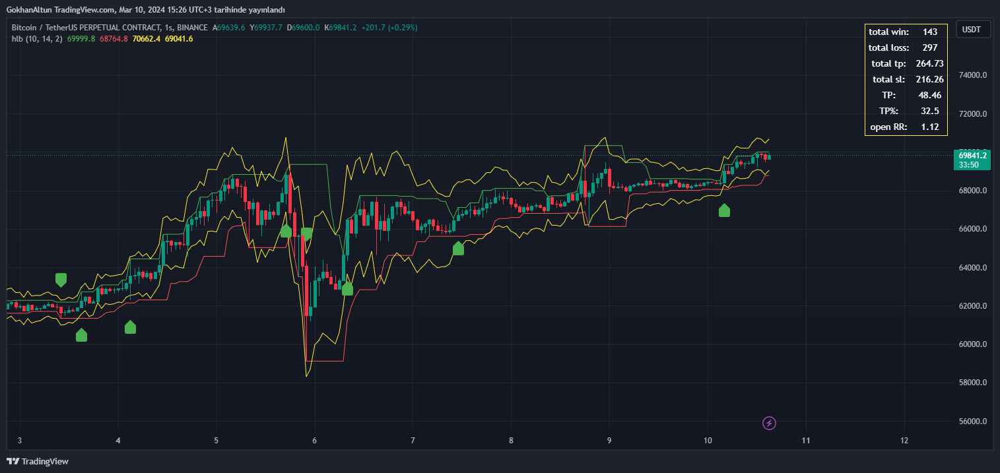

# High-Low Breakout Indicator (TradingView/Pinescript)
 This indicator shows the breakouts of the highest and lowest levels within a specific period and simulates opening trades at these breakouts. It utilizes a trailing stop and employs ATR (Average True Range) to determine the stop level.

 - The indicator tracks the highest and lowest levels of the asset within the specified period.
 - A buy trade is initiated when the highest level is breached.
 - The stop level is calculated using a multiple of ATR and is used as a trailing stop.
 - Incorporating ATR allows for the creation of more effective stop levels by adapting to market volatility.
 - Similarly, a sell trade can be opened when the lowest level is breached.

 This indicator assists traders implementing breakout strategies in identifying potential entry and exit points.

### Output Table Description
 - TotalWin: Total number of take profit (TP) instances
 - TotalLoss: Total number of stop loss (SL) instances
 - TotalTp: Total TP gains
 - TotalSl: Total SL gains
 - Tp: Remaining TP gains after deducting losses (totalTp - totalSl)
 - Tp%: Win rate
 - Open RR: Open trade profit/loss status
 
### Warning Note:
 This indicator is designed to assess breakout strategies in the market. However, like any trading strategy, it can provide false signals and lead to losses. Exercise caution when using the indicator and ensure that each of your trades adheres to risk management principles. Additionally, past performance is not indicative of future results. Please conduct your own research and test your strategy before executing any trades.

 ### Screenshots:

  </img>


 ### Code:
```js
// This Pine Script™ code is subject to the terms of the Mozilla Public License 2.0 at https://mozilla.org/MPL/2.0/
// © GokhanAltun

//@version=5
indicator("hlb", overlay = true, max_labels_count = 500)


bar_len = input.int(10, title = "Bar length")

atr_len = input.int(14, title = "ATR Length")
atr_x = input.float(2.0, title = "ATR Multiplier", step = 0.1)

start_date = input.time(timestamp("1 jan 2024 00:00"), title = "Start Date", confirm = true)
end_date = input.time(timestamp("1 jan 2024 00:00"), title = "End Date", confirm = true)

current_time = timestamp(year, month, dayofmonth, hour, minute, second)

highest = ta.highest(high, bar_len)
lowest = ta.lowest(low, bar_len)

atr = ta.atr(atr_len)
atr_up = close + (atr * atr_x)
atr_down = close - (atr * atr_x)

plot(highest, title = "High Line", color = color.green)
plot(lowest, title = "Low Line", color = color.red)
plot(atr_up, color = color.yellow)
plot(atr_down, color = color.yellow)


var long_pos = false
var short_pos = false

var entry_price = 0.0
var sl_price = 0.0
var risk = 0.0

var total_win = 0
var total_loss = 0
var total_tp = 0.0
var total_sl = 0.0
var current_rr = 0.0


if bar_index >= atr_len and current_time >= start_date and current_time <= end_date
    // === Long ===
    if long_pos == false and short_pos == false and close[1] > highest[2]
        long_pos := true
        entry_price := close[1]
        sl_price := close[1] - (atr[1] * atr_x)
        risk := entry_price - sl_price
        alert("Open Long", alert.freq_once_per_bar_close)
        label.new(bar_index[1], low, yloc=yloc.belowbar, color = color.green, style = label.style_label_up)

    // === Long SL Level Updater ===
    if long_pos and short_pos == false and close[1] - (atr[1] * atr_x) > sl_price
        sl_price := close[1] - (atr[1] * atr_x)

    // === Long TP/SL ===
    if long_pos and short_pos == false and low <= sl_price
        long_pos := false
        alert("Close Long", alert.freq_once_per_bar_close)
        current_rr := 0.0
        if sl_price > entry_price
            total_win += 1
            rr = (sl_price - entry_price) / risk
            total_tp := total_tp + rr
        
        if sl_price < entry_price
            total_loss += 1
            rr = (entry_price - sl_price) / risk
            total_sl := total_sl + rr

        // label.new(bar_index, high, yloc=yloc.abovebar, color = color.red, style = label.style_label_down)
        

    // === Long Open ===
    if long_pos
        current_rr := (close - entry_price) / risk


    // === Short ===
    if long_pos == false and short_pos == false and close[1] < lowest[2]
        short_pos := true
        entry_price := close[1]
        sl_price := close[1] + (atr[1] * atr_x)
        risk := sl_price - entry_price
        alert("Open Short", alert.freq_once_per_bar_close)
        label.new(bar_index[1], high, yloc=yloc.abovebar, color = color.green, style = label.style_label_down)

    // === Short SL Level Updater ===
    if short_pos and long_pos == false and close[1] + (atr[1] * atr_x) < sl_price
        sl_price := close[1] + (atr[1] * atr_x)

    // === Short TP/SL ===
    if short_pos and long_pos == false and high >= sl_price 
        short_pos := false
        alert("Close Short", alert.freq_once_per_bar_close)

        current_rr := 0.0    
        if sl_price < entry_price
            total_win += 1
            rr = (entry_price - sl_price) / risk
            total_tp := total_tp + rr
        
        if sl_price > entry_price
            total_loss += 1
            rr = (sl_price - entry_price ) / risk
            total_sl := total_sl + rr

        // label.new(bar_index, low, yloc=yloc.belowbar, color = color.red, style = label.style_label_up)
        
    // === Short Open ===
    if short_pos
        current_rr := (entry_price - close) / risk

var table dataTable = table.new(position = position.top_right, columns = 2, rows = 7, frame_width = 1, frame_color = color.yellow)
if barstate.islast
    table.cell(dataTable, column = 0, row = 0, text = "total win:", text_color = color.white)
    table.cell(dataTable, column = 0, row = 1, text = "total loss:", text_color = color.white)
    table.cell(dataTable, column = 0, row = 2, text = "total tp:", text_color = color.white)
    table.cell(dataTable, column = 0, row = 3, text = "total sl:", text_color = color.white)
    table.cell(dataTable, column = 0, row = 4, text = "TP:", text_color = color.white)
    table.cell(dataTable, column = 0, row = 5, text = "TP%:", text_color = color.white)
    table.cell(dataTable, column = 0, row = 6, text = "open RR:", text_color = color.white)
    
    table.cell(dataTable, column = 1, row = 0, text = str.tostring(total_win), text_color = color.white)
    table.cell(dataTable, column = 1, row = 1, text = str.tostring(total_loss), text_color = color.white)
    table.cell(dataTable, column = 1, row = 2, text = str.tostring(math.round(total_tp, 2)), text_color = color.white)
    table.cell(dataTable, column = 1, row = 3, text = str.tostring(math.round(total_sl, 2)), text_color = color.white)
    table.cell(dataTable, column = 1, row = 4, text = str.tostring(math.round(total_tp - total_sl, 2)), text_color = color.white)
    table.cell(dataTable, column = 1, row = 5, text = str.tostring(math.round((total_win / (total_win + total_loss)) * 100, 2)), text_color = color.white)
    table.cell(dataTable, column = 1, row = 6, text = str.tostring(math.round(current_rr, 2)), text_color = color.white)

```